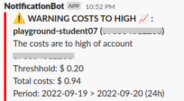

# Terraform AWS Linked Accounts Budget Alarms

This module implements an automatic check if member accounts of an AWS
organization exceed their spent cost limits. When an account threshold is
reached a notification is sent to a slack channel.

## How does it work

Every day a lambda script runs the cost explorer and compares the total costs
of each linked account with the configured budget. If costs exceed a slack
notification is sent using a [webhook](https://api.slack.com/messaging/webhooks).

A Role with the querying account defined as trustee. And a policy allowing
ListAccess to the Cost Explorer is must be created on the master account. The
ARN of this role should be configured in `sts_master_account_role_arn`.

<!-- BEGIN_TF_DOCS -->
## Requirements

No requirements.

## Providers

| Name | Version |
|------|---------|
|  [aws](#provider\_aws) | n/a |

## Modules

| Name | Source | Version |
|------|--------|---------|
|  [lambda\_function](#module\_lambda\_function) | terraform-aws-modules/lambda/aws | 3.3.1 |

## Resources

| Name | Type |
|------|------|
| [aws_cloudwatch_event_rule.trigger_lambda](https://registry.terraform.io/providers/hashicorp/aws/latest/docs/resources/cloudwatch_event_rule) | resource |
| [aws_cloudwatch_event_target.lambda_target](https://registry.terraform.io/providers/hashicorp/aws/latest/docs/resources/cloudwatch_event_target) | resource |
| [aws_iam_policy_document.lambda_extra_permissions](https://registry.terraform.io/providers/hashicorp/aws/latest/docs/data-sources/iam_policy_document) | data source |

## Inputs

| Name | Description | Type | Default | Required |
|------|-------------|------|---------|:--------:|
|  [check\_schedule](#input\_check\_schedule) | Schedule expression that defines when and/or how often the budgets should be checked.  See https://docs.aws.amazon.com/AmazonCloudWatch/latest/events/ScheduledEvents.html for valid schedule expressions. | `string` | `"rate(1 day)"` | no |
|  [configured\_accounts\_json](#input\_configured\_accounts\_json) | JSON string which configures account to have their own threshold cost amount.  example: {   "configured\_accounts": {     "000000000013": {       "threshold\_amount": 250     }   } } | `string` | `"{ \"configured_accounts\": {} }\n"` | no |
|  [default\_threshold](#input\_default\_threshold) | When an account has no own threshold configuration this default threshold triggers an alarm. | `number` | n/a | yes |
|  [slack\_webhook\_url](#input\_slack\_webhook\_url) | Slack webhook url to channel which receives the notifications | `string` | n/a | yes |
|  [sts\_master\_account\_role\_arn](#input\_sts\_master\_account\_role\_arn) | STS Master Account Role ARN to the master account Cost Explorer Service.  When you run this function from another account then the master organization account this role gives the querying account access. | `string` | `""` | no |

## Outputs

No outputs.
<!-- END_TF_DOCS -->
